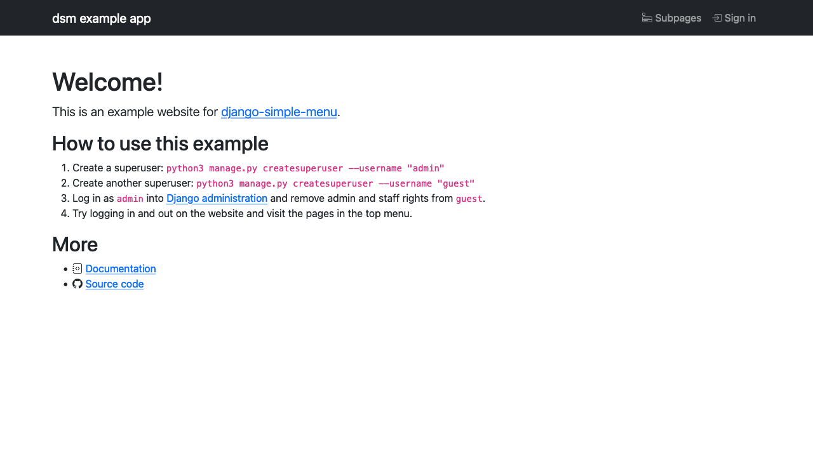
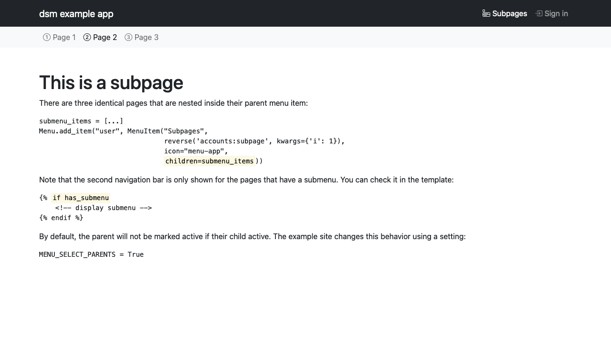
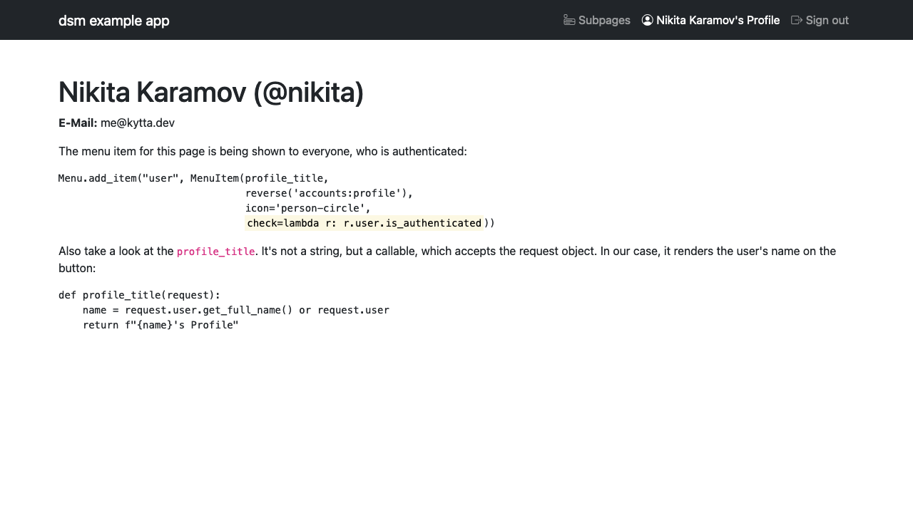
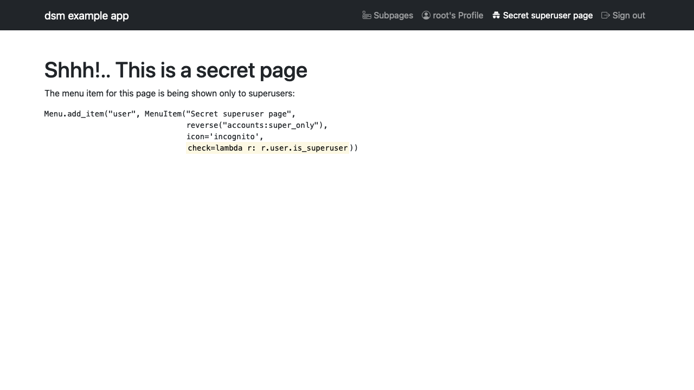

==============================
django-simple-menu example app
==============================

Set up
------

1. Create a virtualenv, source it, and install dependencies::

       python3 -m venv .venv
       source .venv/bin/activate
       pip install -r requirements.txt

2. Initialize a database and create test users::

       python3 manage.py makemigrations
       python3 manage.py migrate
       python3 manage.py createsuperuser --username admin
       python3 manage.py createsuperuser --username user

3. Run server::

       python3 manage.py runserver

4. Go to Django administration (probably under http://127.0.0.1:8000/admin/)
   and remove superuser rights from the second user you've created.

5. Look around the website, try logging in, have fun :)

Screenshots
-----------

   Index page of the example app

   Page featuring a submenu

   Page only shown to the authenticated users

   Page only shown to the superusers

Learn more
----------

Full documentation, including installation and configuration instructions, is
available at https://django-simple-menu.readthedocs.io/.

``django-simple-menu`` is released under the *BSD 2-Clause "Simplified" License*.
If you like it, please consider contributing!

``django-simple-menu`` was originally created by
Evan Borgstom <evan@borgstrom.ca> and was further developed by many
contributors_.

.. _contributors: https://github.com/jazzband/django-simple-menu/graphs/contributors
